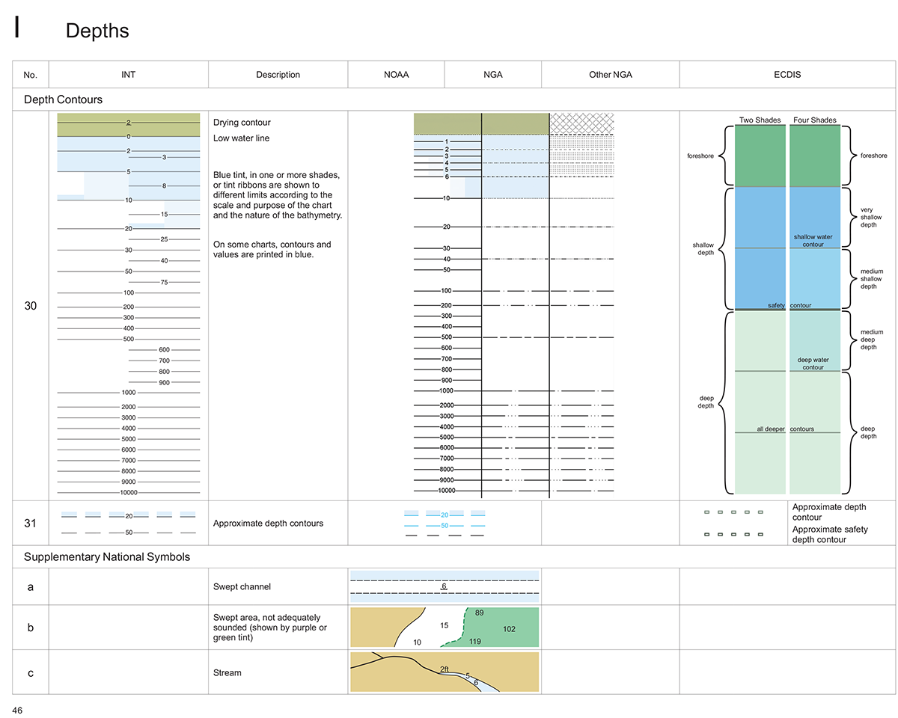

# tegola-bathymetry

Rendering a [GEBCO gridded bathymetric data set](http://www.gebco.net/) using Tegola.

This repo houses configuration files used to run a [Tegola](https://github.com/go-spatial/tegola)-based vector tile service for bathymetric data. We use it in combination with [basic OpenStreetMap data rendering](https://github.com/go-spatial/tegola-osm) and [specialized seamark-tagged data rendering](https://github.com/terranodo/tegola-openseamap). The goal here is to match NGA-style contour symbology as laid out in [US Chart 1](https://www.nauticalcharts.noaa.gov/publications/docs/us-chart-1/ChartNo1.pdf):



## Repo files of interest

- bathymetry.toml - a [Tegola](https://github.com/go-spatial/tegola) configuration file
- .env-example - a skeleton for setting configuration and sensitive values via environment variables
- systemctl/bathymetry.service - we use this in production to start and stop the service

## Setting database connections with environment variables

It can be desirable to use separate databases for a Tegola installation. For example, even though you may have OpenStreetMap data for multiple metro or Geofabrik extracts, you'll likely only need one copy of the OSM land polygons and Natural Earth Data.

Tegola v0.6.0 and higher supports the use of environment variables to configure cache and database connection information. Copy `.env-example` to `.env` and customize away. A `Procfile` is included for those who use tools that recognize it, such as [foreman](https://github.com/ddollar/foreman), clones such as [node-foreman](https://github.com/strongloop/node-foreman) or Python's [honcho](https://github.com/nickstenning/honcho), or the [Heroku Command Line Interface](https://devcenter.heroku.com/articles/heroku-cli) which bundles it.

For use in development, you should be able to:

```bash
npm install foreman -g
nf start
```

For use in production, you may install `systemctl/bathymetric.service` into `/lib/systemd/system/`. Make sure all paths are correct for your installation, then use:
```
sudo systemctl start bathymetry
```
to start the service,
```
sudo systemctl stop bathymetry
```
to stop the service, and
```
sudo systemctl enable bathymetry
```
to start the service on system boot.
